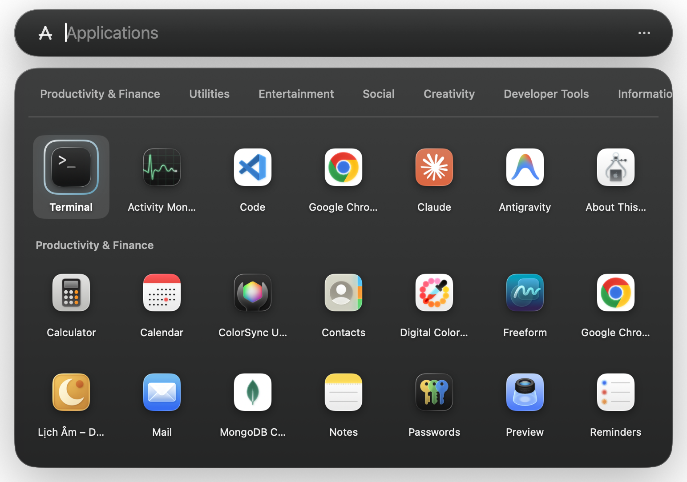

# Lightspot 🔍

[English](README.md) | [简体中文](README_zh-CN.md) | [Español](README_es.md) | [日本語](README_ja.md) | [Français](README_fr.md)

> **Un reemplazo ligero y perfecto para Spotlight de macOS, construido en Swift puro, diseñado para desarrolladores y usuarios avanzados que desean velocidad instantánea sin la sobrecarga de la indexación de archivos.**

Lightspot reproduce fielmente el moderno diseño de píldora flotante y la estética de cristal translúcido de Spotlight de macOS (`NSVisualEffectView`). Bajo el capó, ofrece una capacidad de respuesta por debajo del milisegundo (< 1.0 ms de búsqueda) con **cero indexación de archivos en segundo plano**, consumiendo **0.0% de CPU en reposo** y menos de **25 MB de RAM**.



---

## ⚡ Inicio Rápido

### 📦 Descarga e Instalación en una sola línea
Simplemente copia y pega este comando en tu Terminal para descargar, extraer e instalar automáticamente el último **Lightspot** en tu carpeta `/Applications`:

```bash
curl -fsSL https://raw.githubusercontent.com/openhoangnc/mac-lightspot/main/install.sh | bash
```

*(Opcional: Pasa `--user` para instalar en `~/Applications`: `curl -fsSL https://raw.githubusercontent.com/openhoangnc/mac-lightspot/main/install.sh | bash -s -- --user`)*

---

### 🗑️ Desinstalación Completa
¿Deseas eliminarlo por completo? Este comando detiene la aplicación, elimina los elementos de inicio automático, borra las preferencias de usuario y elimina el paquete de la aplicación:

```bash
curl -fsSL https://raw.githubusercontent.com/openhoangnc/mac-lightspot/main/uninstall.sh | bash
```

---

## 💡 ¿Por qué Lightspot?

Spotlight integrado de Apple fue diseñado para la búsqueda casual de archivos. Pero para los desarrolladores y usuarios avanzados, los procesos en segundo plano de Spotlight a menudo crean una fricción severa en el sistema. **Lightspot está construido para resolver esto.**

### El Problema: Spotlight de Apple

1. **Drenaje de CPU y Batería:** Los demonios en segundo plano (`mds`, `mdworker`) indexan archivos agresivamente. Un simple `npm install` o `git checkout` puede clavar tu CPU al 100%, encendiendo los ventiladores y matando la duración de la batería.
2. **Aplicaciones Faltantes:** El índice de Spotlight frecuentemente se corrompe, lo que hace que falle en su trabajo más básico: encontrar aplicaciones como Terminal o Slack. Solucionarlo requiere ejecutar comandos oscuros de `mdutil` para reconstruir el índice desde cero.
3. **Uso Excesivo de Disco:** Spotlight almacena en caché silenciosamente metadatos en una carpeta oculta `/.Spotlight-V100`. En máquinas de desarrolladores, este índice regularmente se infla a **50GB–200GB**, desperdiciando costoso almacenamiento SSD.
4. **Acaparamiento de Memoria:** Los procesos de Spotlight frecuentemente tienen fugas y consumen gigabytes de memoria unificada RAM, memoria que debería estar disponible para tu IDE, Docker o LLMs locales.
5. **Rastreo de Archivos no Deseado:** Excluir carpetas masivas como `node_modules`, `.git` o `.venv` a través de los Ajustes del Sistema es notoriamente torpe, lento y a menudo se reinicia durante las actualizaciones de macOS.

*(Ver reportes de la comunidad: [High CPU](https://www.reddit.com/r/MacOS/comments/1p10c3f/pages_caused_insane_cpu_spikes_on_macos_i_think_i/), [Missing Apps](https://www.reddit.com/r/MacOS/comments/1gjhiha/spotlight_not_looking_for_apps/), [Storage Waste](https://dev.to/vvo/how-to-avoid-spotlight-using-hundreds-of-gbs-and-rebuild-its-index-4kki), [Memory Leaks](https://discussions.apple.com/thread/256167358?sortBy=rank))*

---

## ⚡ La Solución: Arquitectura de Cero Indexación

Lightspot soluciona estos problemas adoptando un enfoque fundamentalmente diferente: **Cero indexación de archivos en segundo plano.**

En lugar de rastrear agresivamente todo tu disco duro, Lightspot se centra estrictamente en lo que los usuarios avanzados realmente buscan: Aplicaciones, Proyectos IDE, Pestañas del Navegador, Utilidades para Desarrolladores y Comandos Personalizados.

### Matriz de Comparación

| Métrica | Spotlight de Apple | Raycast / Alfred | Lightspot 🔍 |
|:---|:---|:---|:---|
| **Indexación de Archivos** | Rastreo incontrolado en segundo plano | Opcional / Configurable | **Nunca** (Por garantía arquitectónica) |
| **Uso de CPU en Reposo** | Picos de 100%+ durante operaciones | 1% – 5% en segundo plano | **0.0%** (duerme por completo) |
| **Almacenamiento en Disco** | 10 GB – 200 GB+ en caché oculta | 100 MB – 1 GB | **0 KB** (Huella de disco cero) |
| **Huella de RAM** | 500 MB – 2 GB+ | 200 MB – 500 MB | **~15 – 25 MB** (Swift Puro) |
| **Lanzamiento de Aplicaciones** | Falla con frecuencia; requiere reconstrucciones | Confiable | **100% Confiable** (Escaneo directo) |
| **Latencia de Búsqueda** | Retardada (50 – 200 ms) | 10 – 30 ms | **< 1.0 ms** (síncrono instantáneo) |
| **Privacidad Offline** | Envía telemetría de Siri a Apple | Requiere cuenta para sincronización | **100% Local, Offline y Libre de Telemetría** |

---

## 🛠️ Personalización Centrada en el Desarrollador y Flujos de Trabajo Avanzados

Lightspot fue diseñado desde cero como el centro de comandos principal de un desarrollador. Cada aspecto puede ser moldeado según tus necesidades exactas de terminal, editor, script y flujo de trabajo:

### 1. ⚡ Comandos Personalizados y Ejecutores de Scripts (`⌘⇧C`)
Abre el Editor de Comandos Personalizados interactivo con **`⌘⇧C`** para crear y organizar atajos personalizados:
- **4 Motores de Ejecución**:
  - `terminal`: Ejecuta el comando directamente en tu emulador de terminal preferido.
  - `shell`: Ejecuta sin interfaz en segundo plano a través de `/bin/zsh`.
  - `applescript`: Ejecuta automatizaciones nativas de AppleScript de macOS.
  - `url`: Abre URLs parametrizadas en tu navegador predeterminado.
- **Expansión Dinámica de Parámetros**:
  - Usa `{query}`, `%s` o `%@` para sustituir cualquier argumento que escribas después del comando.
- **Disparadores de Prefijo**:
  - Asigna prefijos personalizados de 1-3 letras (ej. `dlog <contenedor>` para seguir logs de docker, `c <url>` para headers de curl, `png <host>` para hacer ping).
- **Palabras Clave Personalizadas e Íconos**:
  - Agrega palabras clave difusas (fuzzy) para descubrimiento instantáneo y personaliza íconos usando SF Symbols o íconos de aplicaciones en base64.

### 2. 💬 Fragmentos de Texto Dinámicos (`⌘P` / `snippets`)
Define fragmentos de texto reutilizables (snippets) con expansión automática de variables dinámicas:
- `{{date}}`: Fecha actual (`YYYY-MM-DD`)
- `{{time}}`: Hora actual (`HH:mm:ss`)
- `{{iso}}`: Marca de tiempo ISO 8601 UTC (`2026-09-05T14:30:00Z`)
- `{{uuid}}`: UUID v4 aleatorio
- `{{clipboard}}`: Contenido actual de tu portapapeles

Escribe cualquier palabra clave de snippet (ej. `iso`, `uuid`, `date`) y presiona **`↵`** para copiar la cadena evaluada directamente a tu portapapeles.

### 3. 💻 Elige Entre 7 Emuladores de Terminal Modernos
Lightspot se integra con tu emulador de terminal favorito. Cambia en cualquier momento a través de la barra de menú:
- **Ghostty**, **Warp**, **Alacritty**, **iTerm2**, **Kitty**, **WezTerm** y **Terminal de Apple**.
- **"Terminal en Carpeta de Finder"**: Escribe `term` o presiona la acción para lanzar instantáneamente tu terminal preferida dentro del directorio actualmente abierto en Finder.

### 4. 📂 Descubrimiento de Proyectos Recientes Multi-IDE
Lightspot monitorea automáticamente los espacios de trabajo recientes en:
- **VS Code**, **Cursor**, **Zed**, **Suite JetBrains** (IntelliJ IDEA, WebStorm, PyCharm, CLion, GoLand, Rider, etc.) y **Sublime Text**.
- **Modificadores de Teclado**:
  - `↵` (Return): Abrir el espacio de trabajo en su IDE asociado.
  - `⌘↵` (Command + Return): Lanzar tu terminal preferida en el directorio raíz del proyecto.
  - `⌥↵` (Option + Return): Revelar la carpeta del proyecto en Finder.

### 5. 🔌 Asesino de Procesos y Terminador de Puertos (`kill`)
Termina rápidamente servidores de desarrollo persistentes, tareas en segundo plano atascadas o procesos rebeldes:
- **Matar por puerto:** `kill :3000`, `kill :8080`, `kill :5173` (resuelve automáticamente el PID que escucha a través de `lsof`).
- **Matar por nombre de proceso o PID:** `kill node`, `kill python`, `kill 14205`.
- **Niveles de terminación:**
  - `↵` (Return): Terminación elegante (`SIGTERM`).
  - `⌥↵` (Option + Return): Cierre forzoso (`SIGKILL`).

### 6. 🛠️ Utilidades para Desarrolladores Offline Integradas (DevTools)
Realiza operaciones comunes de desarrollador en milisegundos sin abrir utilidades web ni instalar paquetes CLI:
- **`uuid`**: Genera un UUID v4 criptográficamente aleatorio.
- **`b64 <texto>`** / **`b64d <hash>`**: Codifica y decodifica Base64.
- **`urlencode <url>`** / **`urldecode <url>`**: Codificación porcentual de URL.
- **`hash sha256 <texto>`** / **`sha1`** / **`md5`**: Sumas de comprobación criptográficas instantáneas.
- **`jwt <token>`**: Decodifica e imprime bonitamente los encabezados y la carga útil de JWT.
- **`json <raw>`**: Formatea, sangra y valida JSON minificado.
- **`epoch`** / **`now`**: Conversión de marcas de tiempo Unix a fechas humanas y viceversa.
- **`#3498db`**: Muestra de vista previa de color en vivo con copia de Hex, RGB y HSL con un solo clic.

### 7. 🔐 Touch ID sin Interfaz para Sudo y Acciones Privilegiadas
Ejecuta acciones de mantenimiento privilegiadas (`Flush DNS Cache`, `Purge Inactive Memory`) con autenticación biométrica de huellas dactilares:
- **Sin Ventanas Emergentes de Terminal**: Se ejecuta a través de una pseudo-terminal (PTY) en segundo plano invocando `pam_tid.so` de macOS para una autenticación instantánea con Touch ID.
- **Alternar Touch ID para Sudo en Terminal**: Acción de menú con un clic para configurar `/etc/pam.d/sudo_local` para que tus comandos `sudo` habituales en la terminal también puedan usar Touch ID.

### 8. 📜 Historial de zsh y Comandos Fijados (`⌘P` / `⌘⇧P`)
- Busca en tu `~/.zsh_history` local (o `$HISTFILE` personalizado) con clasificación instantánea en menos de un milisegundo.
- Presiona **`⌘P`** en cualquier comando del historial para fijarlo en la parte superior de tu lanzador.
- Presiona **`⌘⇧P`** para administrar, reordenar o eliminar comandos fijados.

### 9. 📦 Copia de Seguridad de Ajustes y Sincronización entre Máquinas
- Exporta toda tu configuración (comandos personalizados, elementos fijados, fragmentos, teclas de acceso rápido) a un archivo JSON limpio.
- La sanitización automática de rutas reemplaza `/Users/username` con `~` para que las configuraciones puedan compartirse fluidamente entre Macs de trabajo y personales.

---

## ✨ Capacidades Adicionales Integradas

- **UI Exacta de Spotlight de macOS**: Píldora de ardilla translúcida flotante con expansión animada y panel de vista previa (`NSVisualEffectView`).
- **HUD de Hardware Mach / IOKit**: Diagnóstico de hardware instantáneo sin subprocesos (`sys`, `cpu`, `ram`, `battery`, `uptime`):
  - Carga de CPU multinúcleo normalizada %
  - RAM Física Activa, Cableada, Comprimida y Total
  - Almacenamiento libre y total del SSD de arranque
  - Porcentaje de batería y estado de carga
- **Matemáticas Inteligentes y Conversiones Relajadas**: Analizador matemático de descenso recursivo completo que admite unidades, monedas y bases numéricas:
  - Matemáticas: `(25 * 4) + sqrt(144)`, `2^16`, `log(1000)`
  - Unidades: `100km in mi`, `72F in C`, `16GB in MB`
  - Moneda: `$100 in EUR`, `50 GBP in USD`
  - Bases numéricas: `0xFF in dec`, `255 in hex`, `0b1010 in dec`
- **Marcadores y Pestañas del Navegador Predeterminado**: Integración de marcadores y pestañas abiertas sin redundancia solo para tu navegador predeterminado activo (**Chrome**, **Safari**, **Firefox**, **Arc**, **Brave**, **Edge**).
- **Portapapeles Efímero en Memoria**: Búfer de anillo volátil solo en RAM (hasta 50 elementos) al que se accede mediante `clip <query>`. Nunca escribe en el disco y filtra estrictamente los administradores de contraseñas (`1Password`, `Bitwarden`).
- **Enlaces Profundos de Ajustes del Sistema de macOS**: Más de 35 enlaces profundos directos que abren paneles de ajustes específicos de macOS (`x-apple.systempreferences:...`).
- **Búsqueda Web Multimotor**: Atajos de prefijo integrados: `gh` (GitHub), `so` (StackOverflow), `npm`, `crates`, `wiki`, `mdn`, `brew`, `yt`, `ddg`.

---

## 🛑 Gestión Completa de Spotlight de macOS

Lightspot incluye automatizaciones integradas en la barra de menú para deshabilitar o rehabilitar el Spotlight integrado de Apple:

1. **Atajo de Spotlight (`⌘Space`)**: Deshabilita o restaura el atajo `⌘Space` predeterminado de Apple en las teclas de acceso rápido simbólicas de macOS sin requerir root.
2. **Proceso en Segundo Plano (`com.apple.Spotlight`)**: Deshabilita o habilita el agente de la GUI en segundo plano de Spotlight a través de `launchctl`.
3. **Indexación de Archivos (`mdutil`)**: Apaga por completo la indexación de metadatos del sistema de archivos (`mds` / `mds_stores`) en todos los volúmenes montados.
4. **Acciones Maestras de 1 Clic**:
   - **`Disable Everything (Shortcut + Process + Indexing)...`**: Apaga por completo Spotlight de Apple para recuperar CPU, RAM, espacio en disco y `⌘Space`.
   - **`Restore Default Spotlight...`**: Revierte cada ajuste de nuevo a los valores predeterminados de fábrica de macOS en cualquier momento.

---

## 🚀 Construcción e Instalación (No Requiere Xcode)

### 📦 Opción A: Instalación en una sola línea (Recomendada)
Descarga e instala la última versión precompilada directamente:
```bash
curl -fsSL https://raw.githubusercontent.com/openhoangnc/mac-lightspot/main/install.sh | bash
```

### 🛠️ Opción B: Construir desde el Código Fuente (Repositorio Local)
```bash
# 1. Compilar paquete de lanzamiento
./build.sh
# o: make build

# 2. Ejecutar directamente
./run.sh
# o: make run

# 3. Instalar en /Applications (o en ~/Applications con --user)
./install.sh
# o: make install

# 4. Desinstalar
./uninstall.sh
# o: make uninstall
```

### 4. Pruebas y Verificación
Lightspot incluye 112 suites de pruebas automatizadas y comprobaciones de tiempo de ejecución del sistema en vivo:
```bash
# Pruebas de lógica central y motor (24 suites de pruebas)
swiftc -o /tmp/test_engine scripts/test_engine.swift Sources/Lightspot/Core/*.swift Sources/Lightspot/System/TerminalLauncher.swift && /tmp/test_engine

# Comprobaciones del sistema en vivo (88 comprobaciones de verificación)
swiftc -o /tmp/deep_verify scripts/deep_verify.swift Sources/Lightspot/Core/*.swift Sources/Lightspot/System/TerminalLauncher.swift && /tmp/deep_verify
```

---

## ⌨️ Atajos y Navegación

| Tecla | Acción |
|---|---|
| **`⌘Space`** / **`⌘⇧Space`** | Invocar o descartar Lightspot en cualquier lugar (configurable en la barra de menú) |
| **`↓` / `↑`** | Navegar a través de los resultados de búsqueda |
| **`Return` (`↵`)** | Abrir la aplicación seleccionada, proyecto en IDE, ejecutar comando o copiar cálculo |
| **`⌘Return` (`⌘↵`)** | Abrir proyecto seleccionado en la Terminal preferida |
| **`⌥Return` (`⌥↵`)** | Revelar proyecto en Finder / Forzar el cierre del proceso seleccionado (`SIGKILL`) |
| **`⌘P`** | Fijar o desfijar comando del Historial de la Terminal seleccionado |
| **`⌘⇧P`** | Abrir la superposición del administrador de comandos fijados |
| **`⌘⇧C`** | Abrir la superposición del administrador de comandos personalizados |
| **`⌘Y`** / **`⌘⇧H`** | Abrir la superposición del administrador de historial de búsqueda |
| **`Escape`** | Descartar superposiciones, limpiar el campo de búsqueda o cerrar Lightspot |
| **Clic Afuera** | Descarta automáticamente el panel flotante |

---

## 🔒 Garantías de Privacidad y Seguridad

- **Cero Indexación de Archivos**: Lightspot nunca indexa tus archivos personales, documentos, descargas o repositorios de código.
- **Portapapeles Efímero Solo en RAM**: El historial del portapapeles permanece exclusivamente en memoria volátil (nunca se escribe en el disco) e ignora activamente los tipos ocultos/administradores de contraseñas (`org.nspasteboard.ConcealedType`, `1Password`, `Bitwarden`).
- **Aislamiento del Navegador Predeterminado**: Los marcadores y las pestañas se leen únicamente de tu navegador predeterminado configurado, evitando el raspado entre navegadores.
- **Subprocesos Aislados (Sandboxed)**: Los comandos y scripts se ejecutan solo tras la acción explícita del usuario (`Return` o `⌘↵`).
- **Cero Telemetría y 100% Offline**: Sin solicitudes de red, sin analíticas remotas, sin rastreo.
